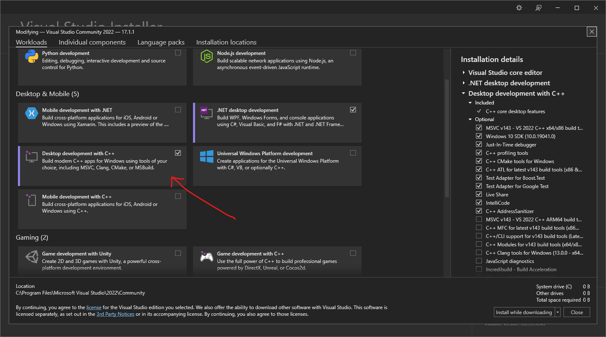

# Visual Studio

## Guia para version 2019 y 2022 community edition

Esta herramienta de Microsoft es la mas facil de usar de entre todas ya que al instalarlo junto con
el workflow de *Desktop Development with C++* este automaticamente instalara:
- Compilador MSVC C/C++ :white_check_mark:
- Herramienta CMake para Windows :white_check_mark:
- Visual Studio (IDE) :white_check_mark:

Y ya con eso estamos listos para trabajar. 

Si haras una instalacion nueva te preguntara que workflows quieres instalar
Para este curso solamente es necesario que seleciones *Desktop Development with C++* deja las opciones por
defecto y selecciona instalar

Si ya tienes una instalacion existente de Visual Studio abre la aplicacion llamada
*Visual Studio instaler* y selecciona modificar eso te llevara a la pantalla anterior donde podras
seleccionar los workflows que deseas, luego selecciona modificar y se comenzara a instalar todo lo necesario

🥳🥳 Felicidades ya puedes abrir la carpeta del repositorio y visual estudio hara el resto
! Recuerda usar la opcion de __abrir folder__ ya que otras opciones esperan archivos especificos
de una solucion de Visual Studio standard